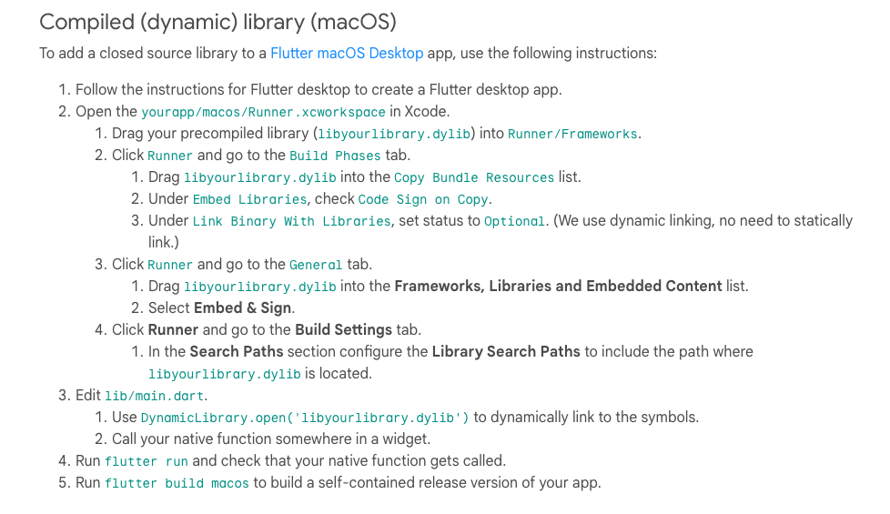
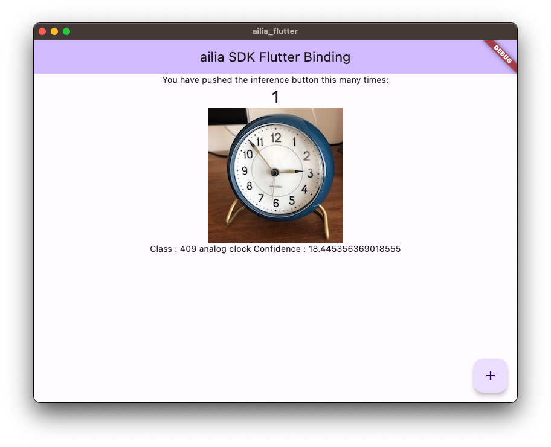

# ailia_flutter

A flutter binding for ailia.

# Test environment

- macOS 13.4

# Setup flutter

This step is not necessary if flutter is already installed.

Reference : https://zenn.dev/kazutxt/books/flutter_practice_introduction/viewer/01_chapter0_aboutme

## Install flutter

Download flutter sdk and unzip.

https://docs.flutter.dev/get-started/install

Add to path to .zshrc.

```
export PATH="/Users/xxx/flutter/bin:$PATH"
```

## Install vscode extension

1. Install flutter extension.
2. Create new project (flutter: new project) from view -> command pallet.
3. Push run from menu button.

# Bind ailia C API via ffigen (Optional)

The steps below are done with ax and the dart interface files are included in this repository. Therefore, execution is not mandatory.

## Install ffigen

Add ffigen to pubspec.yaml.

https://blog.logrocket.com/dart-ffi-native-libraries-flutter/

## Place ailia header

Place ailia.h to native folder.

## Install llvm

llvm is required to run ffi. The official tutorial says to run brew install llvm. But when calling brew install llvm, the clang arch does not match.

```
tried: '/usr/local/opt/llvm@15/lib/libclang.dylib' (mach-o file, but is an incompatible architecture (have 'x86_64', need 'arm64')),
```

https://stackoverflow.com/questions/71882029/mach-o-file-but-is-an-incompatible-architecture-have-arm64-need-x86-64-i

So try to install llvm on arm architecture. I specified llvm@15 because the build failed on M1 Mac with llvm.

```
arch -arm64 brew install llvm@15
```

However, this command also installs the x86_64 version of clang. Therefore, changed flutter SDK to x86_64 version.

Finally, add llvm path to pubspec.yaml.

```
  llvm-path:
    - '/usr/local/opt/llvm@15'
```

## Convert

Convert ailia.h to ailia.dart with the command below.

```
dart run ffigen
```

Converting a struct will result in a build error, so the generated class needs to be marked final.

https://github.com/dart-lang/sdk/issues/51787

Exported file is [lib/ffi/ailia.dart](lib/ffi/ailia.dart).

# Call ailia API

## Add library to project file

Put libailia.dylib to native folder. Open macos/Runner.xcworkspace. Regist libailia.dylib by following steps.

https://docs.flutter.dev/platform-integration/macos/c-interop



## Add model to assets folder

Put resnet18.onnx and clock.jpg to assets folder. Add these files to pubspec.yaml.

(Already registered in the project in the sample.)

## Predict

When you run this sample, resnet18 classifies what the image is.



# Trouble shooting

## macOS architecture error

Please run below command on Rosetta2.

```
arch -x86_64 pod update
arch -x86_64 pod install
```
# Reference

- https://blog.logrocket.com/dart-ffi-native-libraries-flutter/
